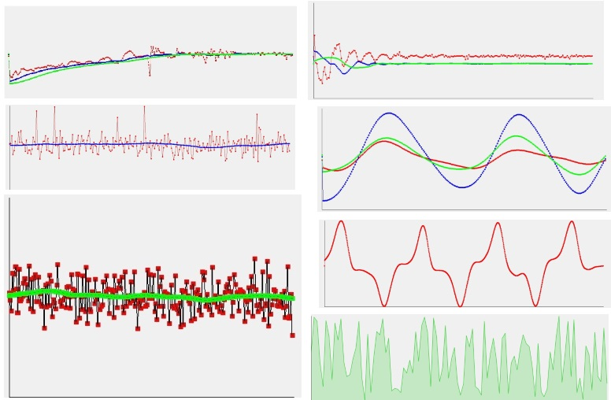
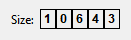
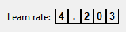
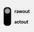

# DWidgets
QWidget base classes for visual interface
# Description
Set of QWidget base classes. This built to static library in 'release' folder.

## Common
All widgets inherit by DWidget and DWidget inherit by QWidget. Both inehrit step in public mode, so all widgets has access to own special specific functions
and QWidget functions. To separate specific function they all name with prefix `x_`

## DDial
Dial widget.
```
    enum DDialMode
    {
        Binary
        ,Mono
        ,Infinite
        ,Discrete
    };
```
DDial has 4 different modes
- In `Binary` mode radial space around dial divide to 2 limited sub spaces - left and right. You can use it to tune any setting with negative and positive value spaces.
- In `Mono` mode dial has single radial space around it. It space is limited ( approximately from 4Pi/3 to 5Pi/3 ).
- In `Infinite` mode you can spin your dial to any direction and any times choosing any poisition of dial pointer.
- In `Discrete` mode you also has infinite radial space but it sapce divide to finite number of positions. Dial can point only on one of this positions

Example of `Discrete` and `Infinite` dials:


Interface:
```
    void x_setValueRange(double min, double max);
    void x_setSensitivity(double s);
    void x_setDiscreteSensitivity(double s);
    void x_setDiscreteLevels(int n);
    void x_setMode(DDialMode m);

    void x_setValue(double v);
    void x_setLeftValue(double v);
    void x_setRightValue(double v);

    void x_setValueByPercent(double percent);
    void x_setLeftValueByPercent(double percent);
    void x_setRightValueByPercent(double percent);
    void x_setLevel(int level);

    void x_rotateToRadian(double radians);
    void x_rotateToDegree(double degree);

    void x_setDrawParam(DrawPart part, DrawParam param);
    void x_setDrawParam(DrawPart part, QColor c_main, QColor c_supp, int value, bool draw_it);
    void x_setDrawVisability(DrawPart part, bool v);
    void x_setRadius(int r);
    void x_setAutoScale(double s);
    void x_disableAutoScale();
 ```
 
## DPlot
This plot widget provide:
- Point groups: create many point groups with different names, colors, visible ans scale settings. Manage point group settings in real time (scale group or hide)
- Axes with any poisition, direction and size. Set autoscale for axes or set fixed size
- In base mode you just add points (x;y) to point group and DPlot draw it with specific settings
- In live mode you can add points in real time and plot will look alive - plot always will shift to left like on digital cardiograph.
- Also you can set any math function to point group and DPlot will draw this function. It also available in live mode.




## DSection
Section with one digit [0;9]. Change value from mouse wheel, cursor, keyboard or inner function or Qt signal
```
signals:
    void dblClicked();
    void clicked();
    void valueChanged(int);
```
Set custom view of sections (any image):
```
    void x_setCustomImages(const QVector<QPixmap> &images);
    void x_setCustomImage(const QPixmap &pm, int index);
```
Interface:
```
  void x_setFont(const QFont &f);
    void x_setFontSize(int size);
    void x_setColor(const QColor &c);
    void x_setBackgroundColor(const QColor &c);

    void x_valueUp();
    void x_valueDown();
    void x_valueChange(int direction);
    void x_valueChange(DAbstractSection *s);
```


## DSpinBox & DDoubleSpinBox
Rotate spin section by mouse wheel, cursor or keyboard




Set custom view of sections (any image):
```
    void x_loadCustomNumbers(const QVector<QPixmap> &cn);
    void x_loadCustomNumber(const QPixmap &pm, int index);
```
Get value:
```
int DSpinBox::x_value();
double DDoubleSpinBox::x_value();
```
Get new value by Qt signal:
```
// DSpinBox:
signals:
    void valueChanged(int);
    
// DDoubleSpinBox:
signals:
    void leftValueChanged(int);
    void rightValueChanged(double);
    void valueChanged(double);
```
For negative values:
```
void x_addSignSection();
```
Interface:
```
//DSpinBox:
    void x_setValue(int v);
    void x_valueUp();
    void x_valueDown();
    void x_setMaxValue();
    void x_setMinValue();
    bool x_isMinValue();
    bool x_isMaxValue();
    int x_getMaxValue();
```
Add rate box:
```
    void x_addMultiplyRateBox(int left, int right);
    void x_addDivisionRateBox(int left, int right);
```
Spin box value will multiply or divide or value from rate box

## DSwitcher

Interface:
```
   void x_setValue(int v);
    void x_setFirst();
    void x_setLast();
    int x_getValue();
    int x_size();

    void x_setName(const QString &name, int i);
    QString x_name(int i);
    void x_addPosition(const QString &name);
    void x_removePosition(int i);
    void x_removePosition(const QString &name);

    void x_setRadius(int r);
```
## Other
#### DButtonsBoard
Panel with buttons

Get clicked button by Qt signal:
```
signals:
    void clicked(int index);
```
