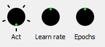
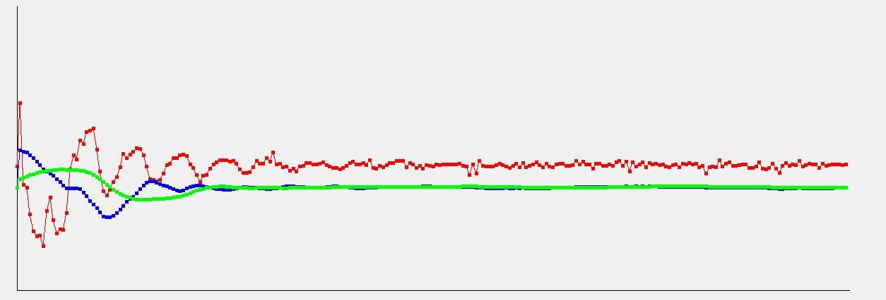
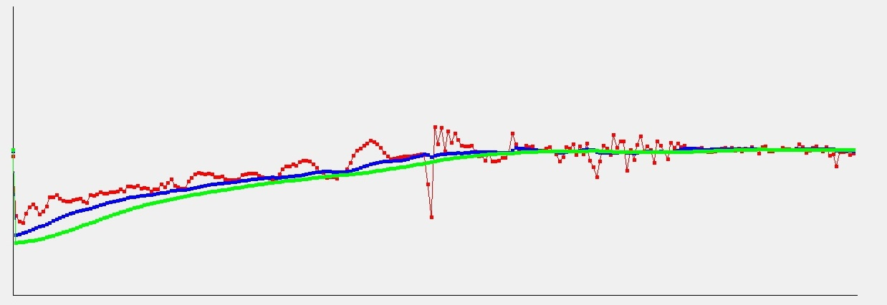
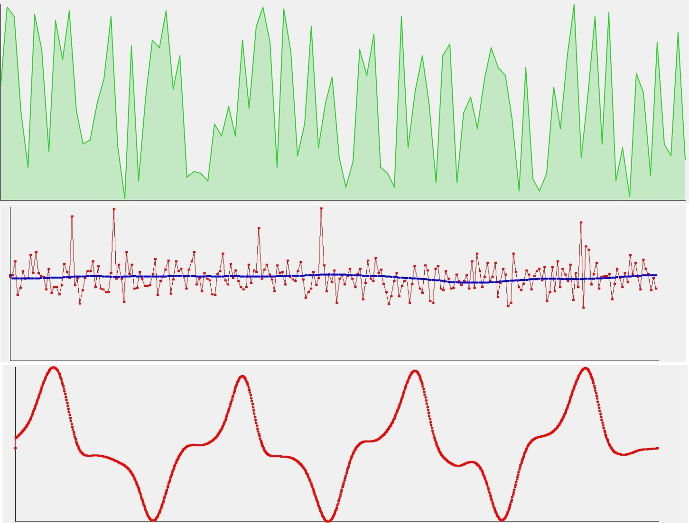

# DWidgets
QWidget base classes for visual interface
# Description
Set of QWidget base classes. This built to static library in 'release' folder.

## Common
All widgets inherit by DWidget and DWidget inherit by QWidget. Both inehrit step in public mode, so all widgets has access to own special specific functions
and QWidget functions. To separate specific function they all name with prefix `x_`

## DDial
Dial widget.
```
    enum DDialMode
    {
        Binary
        ,Mono
        ,Infinite
        ,Discrete
    };
```
DDial has 4 different modes
- In `Binary` mode radial space around dial divide to 2 limited sub spaces - left and right. You can use it to tune any setting with negative and positive value spaces.
- In `Mono` mode dial has single radial space around it. It space is limited ( approximately from 4Pi/3 to 5Pi/3 ).
- In `Infinite` mode you can spin your dial to any direction and any times choosing any poisition of dial pointer.
- In `Discrete` mode you also has infinite radial space but it sapce divide to finite number of positions. Dial can point only on one of this positions

Example of `Discrete` and `Infinite` dials:



Interface:
```
    void x_setValueRange(double min, double max);
    void x_setSensitivity(double s);
    void x_setDiscreteSensitivity(double s);
    void x_setDiscreteLevels(int n);
    void x_setMode(DDialMode m);

    void x_setValue(double v);
    void x_setLeftValue(double v);
    void x_setRightValue(double v);

    void x_setValueByPercent(double percent);
    void x_setLeftValueByPercent(double percent);
    void x_setRightValueByPercent(double percent);
    void x_setLevel(int level);

    void x_rotateToRadian(double radians);
    void x_rotateToDegree(double degree);

    void x_setDrawParam(DrawPart part, DrawParam param);
    void x_setDrawParam(DrawPart part, QColor c_main, QColor c_supp, int value, bool draw_it);
    void x_setDrawVisability(DrawPart part, bool v);
    void x_setRadius(int r);
    void x_setAutoScale(double s);
    void x_disableAutoScale();
 ```
 
## DPlot





## DSpinBox
## DDoubleSpinBox
## DSection
## DSwitcher
## Other
#### DWidget
#### DButtonsBoard
#### DScrollBar
#### DSWitchButton
